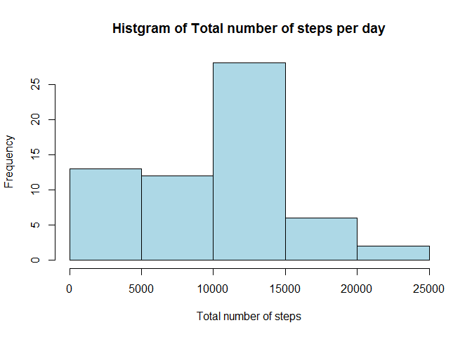
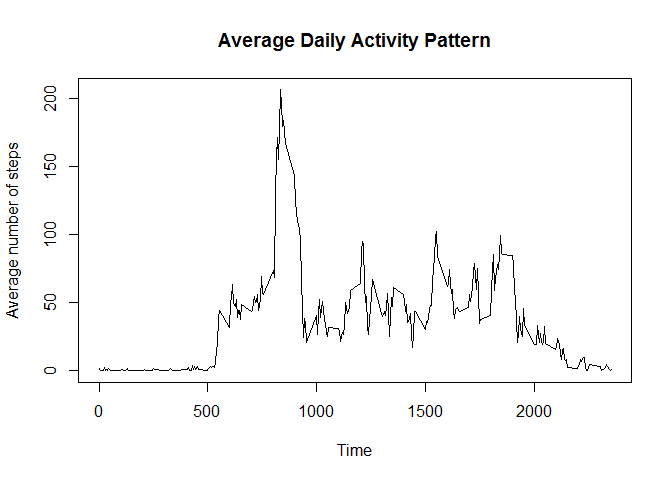
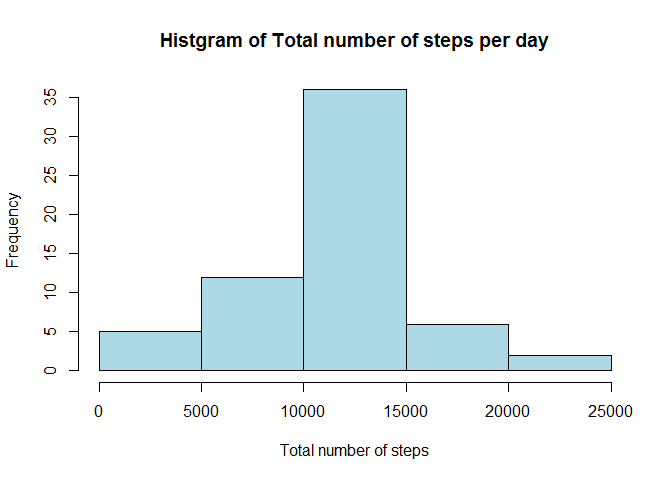
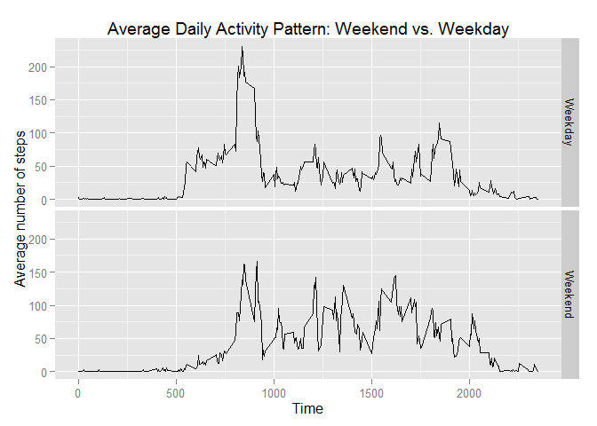

# Reproducible Research: Peer Assessment 1
#Analysis of Activity Monitoring data set
Author: R SEENEEVASSEN  
Date: 14/12/2015

## Loading and preprocessing the data
We use the `read.csv` function to load the dataset.


```r
setwd("C:/Users/lmpro/Desktop/Coursera/RepData_PeerAssessment1")
data <- read.csv("C:/Users/lmpro/Desktop/Coursera/activity.csv")
```

## What is mean total number of steps taken per day?
To calculate the total number of steps per day we will use the `plyr` package while the histogram of the total number of steps per day will be produced using the `base` plotting system.


```r
library(plyr)
data2 <- ddply(data, .(date), summarize, sum = sum(steps, na.rm = T))

hist(data2$sum, xlab = "Total number of steps", main = "Histgram of Total number of steps per day", 
     col = "light blue")
```

 

```r
mean_stepsperday = mean(data2$sum)
median_stepsperday = median(data2$sum)
rbind(mean_stepsperday, median_stepsperday)
```

```
##                        [,1]
## mean_stepsperday    9354.23
## median_stepsperday 10395.00
```

From our calculations above, the mean of the total number of steps per day is 9354 and the median is 10395 to the nearest step.


## What is the average daily activity pattern?
We use the `plyr` package to transform the data and find the average number of steps accross all days per interval. 


```r
data3 <- ddply(data, .(interval), summarize, average = mean(steps, na.rm = T))

plot(data3$interval, data3$average, type = 'l', xlab = "Time", ylab = "Average number of steps", 
     main = "Average Daily Activity Pattern")
```

 

```r
maxsteps = data3[data3$average == max(data3$average),]
maxsteps
```

```
##     interval  average
## 104      835 206.1698
```

Our calculations also show the maximum number of step to occur on average at the 835 interval.


## Imputing missing values
First we will calculate the number of rows with missing values


```r
n_missing_steps = dim(data[data$steps == 'NA',])
n_missing_date = dim(data[data$date == 'NA',])
n_missing_int = dim(data[data$interval == 'NA',])
rbind(n_missing_steps,n_missing_date,n_missing_int)
```

```
##                 [,1] [,2]
## n_missing_steps 2304    3
## n_missing_date     0    3
## n_missing_int      0    3
```

We deduce that only `steps` data is missing and the number of missing rows is 2304.

Our strategy will be to replace the missing `steps` data with the average for that particular interval over the total number of days which we have calculated and collated in `data3`. We collect the missing and original data in a new data.frame object ` data4`.


```r
n=length(data$steps)
for (i in 1:n){
  if(is.na(data$steps[i])) {
    data$stepscomp[i] = data3[data3$interval == data$interval[i],]$average
  } else {
    data$stepscomp[i] = data$steps[i]
  }
}

datacomplete = NULL
datacomplete$steps = data$stepscomp
datacomplete$date = data$date
datacomplete$interval = data$interval
data4 <- (as.data.frame(datacomplete))
```

We will now recompute the mean and median total number of steps per day using our complete dataset.


```r
data5 <- ddply(data4, .(date), summarize, sum = sum(steps))

hist(data5$sum, xlab = "Total number of steps", main = "Histgram of Total number of steps per day", 
     col = "light blue")
```

 

```r
new_mean_stepsperday = mean(data5$sum)
new_median_stepsperday = median(data5$sum)
rbind(new_mean_stepsperday, new_median_stepsperday)
```

```
##                            [,1]
## new_mean_stepsperday   10766.19
## new_median_stepsperday 10766.19
```

The new mean of the total number of steps per day is 1.0766189\times 10^{4} and the new median is 1.0766189\times 10^{4}. Both numbers are higher than our previous estimates of the mean and median with missing `steps` values. 


## Are there differences in activity patterns between weekdays and weekends?
We will create a new factor variable indicating whether a given date is a weekday or a weekend.


```r
date <- strptime(data4$date, format = "%Y-%m-%d")
days <- weekdays(date, abbreviate = T)

days2 = NULL
n=length(data4$date)
for (i in 1:n){
  if(days[i] == "Sun" | days[i] == "Sat"){
    days2[i] = "Weekend"
  } else {
    days2[i] = "Weekday"
  }
}

data4$day = factor(days2)
```

We make use of the `plyr` package again to tranform the data and use the `gglpot2` package to create a panel plot of the Average Daily Activity Pattern split between weekdays and weekends. 


```r
data6 <- ddply(data4, .(interval, day), summarize, average = mean(steps))

library(ggplot2)
```

```
## Warning: package 'ggplot2' was built under R version 3.2.3
```

```r
qplot(interval, average, data = data6, facets = day~., geom = "line", xlab = "Time", 
      ylab = "Average number of steps", main = "Average Daily Activity Pattern: Weekend vs. Weekday")
```

 
